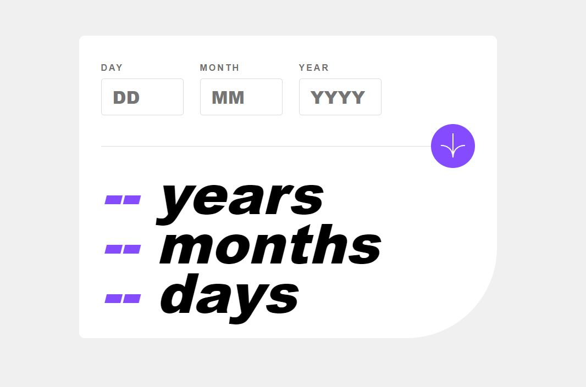

# Frontend Mentor - Age calculator app solution

This is a solution to the [Age calculator app challenge on Frontend Mentor](https://www.frontendmentor.io/challenges/age-calculator-app-dF9DFFpj-Q). Frontend Mentor challenges help you improve your coding skills by building realistic projects.

## Table of contents

- [Overview](#overview)
  - [The challenge](#the-challenge)
  - [Screenshot](#screenshot)
  - [Links](#links)
- [My process](#my-process)
  - [Built with](#built-with)
  - [What I learned](#what-i-learned)
  - [Continued development](#continued-development)
  - [Useful resources](#useful-resources)
- [Author](#author)

## Overview

### The challenge

Users should be able to:

- View an age in years, months, and days after submitting a valid date through the form
- Receive validation errors if:
  - Any field is empty when the form is submitted
  - The day number is not between 1-31
  - The month number is not between 1-12
  - The year is in the future
  - The date is invalid e.g. 31/04/1991 (there are 30 days in April)
- View the optimal layout for the interface depending on their device's screen size
- See hover and focus states for all interactive elements on the page
- **Bonus**: See the age numbers animate to their final number when the form is submitted

### Screenshot



### Links

- Solution URL: [Add solution URL here](https://your-solution-url.com)
- Live Site URL: [Add live site URL here](https://your-live-site-url.com)

## My process

### Built with

- Semantic HTML5 markup
- CSS custom properties
- Flexbox
- CSS Grid
- Mobile-first workflow

### What I learned

- Using Git to clone the repository from Github onto my local directory.

- Brainstorming which methodologies to incorporate.

- Using the element selector method in CSS

- Zeroing the first element in a class:

- Changing the input border color on focus.

```css
.inputSection > :first-child {
  margin-left: 0;
}
```

```html
<h1>Some HTML code I'm proud of</h1>
```

```css
.proud-of-this-css {
  color: papayawhip;
}
```

```js
const proudOfThisFunc = () => {
  console.log("🎉");
};
```

### Continued development

- Might seem silly but I seem to have issues with font styles and sizes. Want to get more comfortable with this.

- Had issues building the error messages. I think it mainly has to do with having the right error message occur at the right element. Sometimes this may be tricky.

### Useful resources

- [Date Article](https://foolishdeveloper.com/javascript-age-calculator-calculate-age-from-date-of-birth/) - This helped me figure out how to go about the date function. Had to take out a pen and paper to make sense as to what happens when the input day and month are greater than the current day and month.

- [Solution Example](https://github.com/Esesosa-max/frontend-mentors/tree/main/age-calculator-app-main) - I searched for an alternative solution because I was having troubles with the error messages. At first I didn't think they would be that difficult but once I started working on them, I kept digging myself into a deep and confusing hole. I reached the point where I just wanted to see what others have done and learn from it.

## Author

- Frontend Mentor - [@chris-azuaje](https://www.frontendmentor.io/profile/chris-azuaje)
- Github - [@chris-azuaje](https://github.com/chris-azuaje)
- Twitter - [@chris_azuaje](https://twitter.com/chris_azuaje)
